# 클라이언트 설정 시스템 기획서 (Client Settings System Design)

본 문서는 `project-flood` 클라이언트 단독으로 동작하는 설정(Settings) 시스템의 상세 기획안입니다. 프로덕션 환경에서 사용될 사운드(BGM/SFX), 햅틱(진동), 로컬라이제이션(다국어) 제어를 목적으로 하며, 서버 통신 없이 클라이언트 내부 로컬 캐싱을 통해 데이터를 유지합니다.

---

## 1. 시스템 목표 및 원칙

1. **서버 독립성**: 설정 값의 변경, 저장, 로드는 100% 클라이언트 디바이스 내부에서 처리하며, 오프라인 상태에서도 완벽하게 동작합니다.
2. **UX 반응성**: 사용자가 설정을 변경하는 즉시 UI 텍스트, 볼륨, 진동 여부가 즉각적으로 반영되어야 합니다. (앱 재시작 불필요)
3. **확장성**: 추후 플랫폼별 SDK 연동이나 계정 연동 시 서버 동기화 기능으로 쉽게 전환할 수 있는 구조로 설계합니다.

---

## 2. 제어 대상 및 세부 스펙

### 2.1. 사운드 제어 (Audio Control)
게임 내 배경음악(BGM) 및 효과음(SFX)을 개별적으로 제어합니다.

| 제어 항목 | 조작 UI 타입 | 데이터 범위 | 기본값 | 비고 |
| :--- | :--- | :--- | :--- | :--- |
| **BGM 볼륨** | Slider | `0.0` ~ `1.0` (Linear / Decibel 변환 적용) | `0.8` | 슬라이더 조작 시 실시간 반영 |
| **BGM 음소거** | Toggle | `Mute (true)` / `Unmute (false)` | `false` | 음소거 시 볼륨 값은 유지, 해제 시 원복 |
| **SFX 볼륨** | Slider | `0.0` ~ `1.0` (Linear / Decibel 변환 적용) | `0.8` | 슬라이더 조작 시 실시간 반영 |
| **SFX 음소거** | Toggle | `Mute (true)` / `Unmute (false)` | `false` | 음소거 시 볼륨 값은 유지, 해제 시 원복 |

* **추가 연동 정책**:
  * **Focus Lost (백그라운드 전환)**: 게임이 백그라운드로 전환될 때(`OnApplicationFocus(false)`), 사운드가 자동으로 일시정지(Pause)되어야 하며, 다시 포커스를 얻을 때 원래 설정 값으로 복구됩니다.

---

### 2.2. 햅틱 제어 (Haptic / Vibration Control)
게임 플레이 중 몰입감을 높이기 위한 햅틱(Vibration) 효과를 제어합니다.

| 제어 항목 | 조작 UI 타입 | 데이터 범위 | 기본값 | 비고 |
| :--- | :--- | :--- | :--- | :--- |
| **햅틱 활성화** | Toggle | `On (true)` / `Off (false)` | `true` | 디바이스가 햅틱 기능을 지원하지 않을 경우 비활성화 노출 |

* **햅틱 피드백 가중치 정책 (Haptic Weight Mapping)**:
  게임 내 다양한 상호작용의 경중에 따라 햅틱 진동 패턴과 강도를 세분화하여 연출합니다.

| 구분 (Weight) | 발생 조건 (In-Game Event) | iOS 햅틱 가이드라인 | Android 햅틱 가이드라인 |
| :--- | :--- | :--- | :--- |
| **Light (Soft)** | - 셀 선택/드래그 시작 - 보드 경계 충돌 | `UIImpactFeedbackStyleLight` | `HapticFeedbackConstants.KEYBOARD_TAP` |
| **Medium** | - 일반 셀 매칭 및 Flood 완료 - 일반 블록/장애물 제거 | `UIImpactFeedbackStyleMedium` | `HapticFeedbackConstants.VIRTUAL_KEY` |
| **Heavy (Strong)** | - 특수 아이템(Bomb, H-Rocket 등) 폭발 - 스테이지 클리어/실패 연출 | `UIImpactFeedbackStyleHeavy` 또는 `UINotificationFeedbackTypeSuccess` | `VibrationEffect.createOneShot(100, Heavy)` |

* **디바이스 대응 정책**:
  * 모바일 디바이스가 햅틱 API를 지원하지 않거나 태블릿 등 진동 모터가 없는 환경의 경우, `Haptic Mute` 상태로 안전하게 폴백(Fallback)하며 예외 에러가 발생하지 않도록 구현합니다.

---

### 2.3. 로컬라이제이션 제어 (Localization / Language)
다국어 지원 및 UI 텍스트 언어 변경을 처리합니다.

* **지원 언어 스펙**:
  1. **한국어 (ko)** - 기본값 (시스템 언어가 한국어일 때)
  2. **영어 (en)** - 기본값 (기타 모든 국가 및 시스템 언어 미지원 시 글로벌 대응)
  3. **일본어 (ja)** - 시스템 언어가 일본어일 때

| 제어 항목 | 조작 UI 타입 | 데이터 범위 | 기본값 | 비고 |
| :--- | :--- | :--- | :--- | :--- |
| **언어 설정** | Dropdown / Button | `ko` / `en` / `ja` | 시스템 언어 감지 | 변경 즉시 UI 텍스트 및 폰트 애셋 실시간 교체 |

* **다국어 실시간 반영 아키텍처 (Live Refresh)**:
  * **LocalizationManager**가 언어 변경 이벤트를 발생시키면, 화면 내에 있는 모든 `LocalizedText` 컴포넌트가 해당 이벤트를 받아 즉시 텍스트 리소스를 갱신합니다.
  * **폰트 에셋 스위칭**: 다국어 지원 시 특정 문자(예: 한국어/일본어)가 픽셀 폰트에서 깨지는 현상을 방지하기 위해 언어 코드별로 지원하는 기본 폰트 패키지를 로드하여 스위칭합니다.
    * **영어**: `m5x7` (Pixel font) 및 `Noto Sans`
    * **한국어**: `NeoDunggeunmo` (CJK Pixel alternative) 및 `Noto Sans KR`
    * **일본어**: `Misaki Font` (CJK Pixel alternative) 및 `Noto Sans JP`

---

### 2.4. 기타 제어: 화면 흔들림 (Screen Shake)
게임플레이 중 연출되는 화면 흔들림(Camera Shake) 효과를 제어합니다. (멀미 방지 및 저사양 기기 최적화)

| 제어 항목 | 조작 UI 타입 | 데이터 범위 | 기본값 | 비고 |
| :--- | :--- | :--- | :--- | :--- |
| **화면 흔들림** | Toggle | `On (true)` / `Off (false)` | `true` | Off 시 카메라 셰이크 코루틴/트윈 스킵 |

---

## 3. 데이터 영속성 및 캐싱 명세 (Data Caching Specification)

서버 통신 없이 로컬 디바이스에 상시 캐싱하며, 가볍고 유실률이 낮은 Unity **PlayerPrefs**를 활용하여 저장합니다.

### 3.1. 캐싱 Key-Value 스키마

| PlayerPrefs Key | 데이터 타입 | 기본값 | 목적 |
| :--- | :--- | :--- | :--- |
| `setting_bgm_volume` | `float` | `0.8f` | BGM 볼륨 수치 |
| `setting_bgm_mute` | `int` (bool) | `0` (false) | BGM 음소거 여부 (0: 재생, 1: 음소거) |
| `setting_sfx_volume` | `float` | `0.8f` | SFX 볼륨 수치 |
| `setting_sfx_mute` | `int` (bool) | `0` (false) | SFX 음소거 여부 (0: 재생, 1: 음소거) |
| `setting_haptic_enabled` | `int` (bool) | `1` (true) | 햅틱 피드백 활성화 여부 (0: 비활성, 1: 활성) |
| `setting_language` | `string` | 시스템 언어 감지 | 로컬라이제이션 설정 언어 코드 (`ko`, `en`, `ja`) |
| `setting_screen_shake` | `int` (bool) | `1` (true) | 화면 흔들림 효과 연출 여부 (0: 미연출, 1: 연출) |

---

## 4. 앱 구동 및 로딩 시퀀스 (Boot & Loading Sequence)

설정 정보는 다른 모든 리소스 및 로비 진입 전에 적용되어야 하므로 `BootScene` 초기 로드 단계에서 최우선으로 초기화합니다.

```mermaid
sequenceDiagram
    autonumber
    participant Boot as BootSceneEntry
    participant Local as PlayerPrefs (Cache)
    participant Sound as SoundManager
    participant Haptic as HapticManager
    participant Loc as LocalizationManager

    Boot->>Local: 설정 데이터 로드 요청
    Local-->>Boot: 저장된 값 반환 (없을 시 Default 매핑)
    
    rect rgb(26, 47, 69)
        note right of Boot: 시스템 초기 설정 값 바인딩
        Boot->>Sound: 볼륨 및 뮤트 상태 전달
        Boot->>Haptic: 햅틱 활성화 유무 설정
        Boot->>Loc: 기본 언어 코드 설정 및 다국어 폰트 에셋 로드
    end
    
    Boot->>Boot: 초기화 완료 후 LobbyScene 로드
```

---

## 5. UI/UX 와이어프레임 설계안 (Settings Panel UI/UX Spec)

설정 팝업(`SettingsPanelView`)은 로비와 인게임(일시정지 팝업을 통해 진입)에서 모두 호출될 수 있는 공용 팝업으로 디자인됩니다. 

### 5.1. UI 레이아웃 구성
* **Title**: "설정" / "Settings"
* **BGM 영역**: BGM 아이콘, BGM 음소거 토글 버튼, 볼륨 조절 슬라이더
* **SFX 영역**: SFX 아이콘, SFX 음소거 토글 버튼, 볼륨 조절 슬라이더
* **햅틱 영역**: 햅틱 아이콘, 햅틱 활성/비활성 토글 스위치
* **화면 흔들림 영역**: 화면 흔들림 활성/비활성 토글 스위치
* **언어 선택 영역**: 지원 언어 선택 드롭다운 (Dropdown) 또는 라디오 버튼 그룹
* **기타 유틸리티 버튼**:
  * **계정 설정 버튼 (`AccountButton`)**: Guest 모드 연동 해제 및 데이터 백업(추후 확장 대비)
  * **버전 텍스트 (`VersionText`)**: 하단에 회색의 작고 차분한 텍스트로 표시 (예: `v1.0.0`)
* **닫기 버튼**: 우상단 Close 버튼 혹은 백드롭 스크린 터치 시 팝업 닫힘 애니메이션 재생 후 종료.

---

## 6. 프로젝트 컨벤션 및 리소스 경로 (Project Convention & Paths)

기획서 및 개발 스펙 검증 시 다음 경로 컨벤션을 준수합니다.

| 구분 | 디렉토리 / 도구 경로 | 역할 |
| :--- | :--- | :--- |
| **기획서** | `docs/` | 게임 설계, UI/UX 규약 등 기획 문서 보관 |
| **TODO-List** | `TODO-List/` | 태스크 관리 및 마일스톤 트래킹 |
| **데이터** | `shared/datas/` | 밸런스 데이터, 기획 수치 CSV 데이터 원본 |
| **프로토콜** | `shared/contracts/` | 클라이언트-서버 통신 데이터 모델 (DTO C#) |
| **DB** | `server/db/` | 데이터베이스 스키마 및 마이그레이션 SQL |
| **서버 API** | `server/src/` | ASP.NET Core 서버 비즈니스 로직 및 API 구현 |
| **API 테스트** | `server/tests/` | 서버 API 통합 테스트 및 유닛 테스트 코드 |
| **클라이언트** | `client/project-flood/Assets/Scripts/` | Unity 클라이언트 핵심 컨트롤러, 서비스, 뷰 코드 |
| **UI 프리팹 생성** | `client/project-flood/Assets/Scripts/Editor/UIEditorSetup.cs` | UI 프리팹 빌드 룰 및 제네레이터 코드 |
| **자동화 파이프라인** | `tools/` (예: `tools/all_generator.bat` 등) | 데이터/패킷/ORM 재생성 자동화 스크립트 |
| **스테이지 에디터** | `tools/stage_editor/` | CSV CRUD 및 레벨 테스트용 Next.js 기반 보드 UI |
| **스트링 테이블** | `shared/datas/string/client_string.csv` | 클라이언트 다국어 텍스트 번역 데이터 원본 |
| **동적 이미지 맵** | `shared/datas/common/dynamic_resource.csv` | 클라이언트 동적 로드용 스프라이트 리소스 매핑 데이터 원본 |
